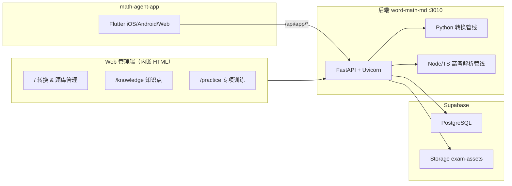
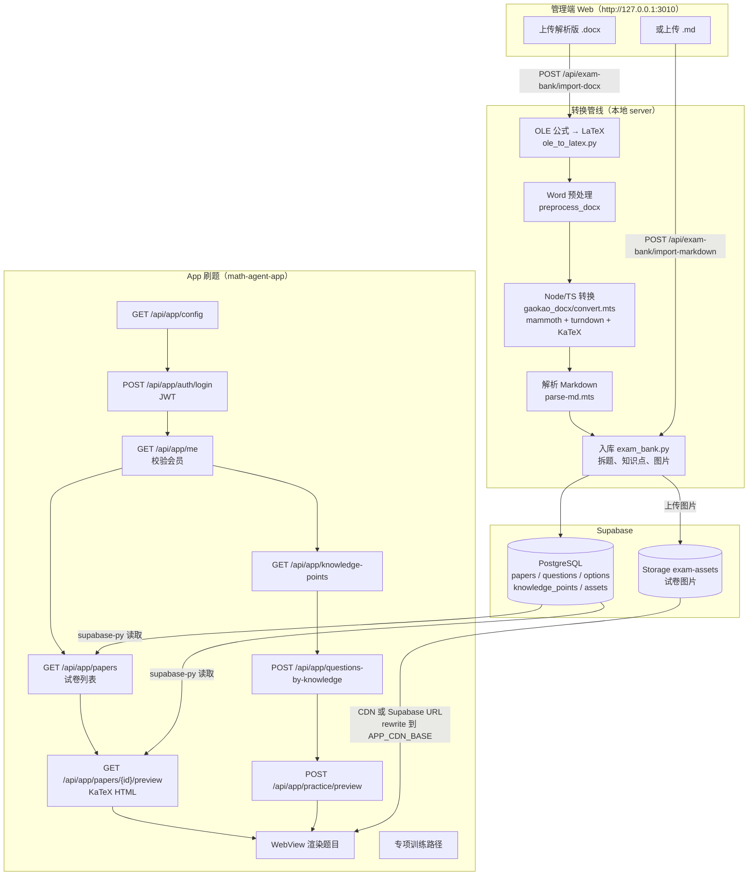

# word-math-md 架构与 API 路由

本文档描述从 **Word 上传到 App 刷题** 的完整数据流，以及所有 `/api/*` 路由在 **管理端** 与 **App** 之间的归属关系。

---

## 一、整体架构



### 各层技术栈

| 层级 | 技术 |
|------|------|
| **前端（Web 管理端）** | FastAPI 内嵌 HTML/CSS/JS；KaTeX 0.18；`word_math_md/static/` |
| **后台** | Python 3.10+、FastAPI、Uvicorn、Pydantic；Node/TS（`gaokao_docx/`）；OCR / PDF / 支付 |
| **数据库** | Supabase（PostgreSQL + Storage `exam-assets`）；`supabase-py` + Service Role Key |
| **App** | 独立仓库 `math-agent-app`；Flutter + WebView + KaTeX；调用 `/api/app/*` |

---

## 二、从 Word 上传到 App 刷题 — 完整数据流



### 分步说明

| 阶段 | 谁触发 | 发生了什么 | 数据落在哪 |
|------|--------|------------|------------|
| **1. 上传** | 管理员在 `/` 页 | 选带「解析版」的 `.docx`，或直传 `.md` | 临时目录 `word-math-md-uploads/` |
| **2. 转换** | `batch_import.import_docx_pipeline` | OLE → 预处理 → Node 转 MD → TS 解析题目结构 | 本地 `.md` + 内嵌/相对路径图片 |
| **3. 入库** | `exam_bank.import_markdown_file` | 写入 `papers`、`questions`、`question_options`；图片进 Storage | Supabase PG + `exam-assets` |
| **4. 登录** | App 用户 | 短信验证码 → JWT → 查 `app_users` / `app_memberships` | Supabase `app_*` 表 |
| **5. 看卷** | App 试卷页 | 拉列表 → 预览 → 服务端 KaTeX 渲染 HTML → WebView 展示 | 只读 PG + CDN 图片 |
| **6. 专项** | App 练习页 | 按知识点筛题 → 组卷预览 → 同样 KaTeX 渲染 | 只读 PG |
| **7. 阅卷（可选）** | App 拍照 | 上传照片 → OCR → 自动批改 → 写入 `answer_sheets` | PG |

### Word 导入管线（代码路径）

```
解析版 .docx
  → convert_ole_docx()           # OLE 公式转 LaTeX
  → preprocess_docx()            # Word 清理
  → convert_docx_like_gaokao()   # Node: gaokao_docx/convert.mts
  → import_markdown_file()       # Node: parse-md.mts + 写入 Supabase
```

---

## 三、全部 `/api/*` 路由归属

**约定：**

- **管理端** — Web 页面 `/`、`/knowledge`、`/practice` 使用；**无 JWT**，依赖本地信任。
- **App** — `math-agent-app` 专用；多数需 **JWT**，内容类还需 **有效会员**（HTTP 402）。
- **回调/公共** — 支付平台或无需登录的公开接口。

---

### 3.1 转换工具（管理端）

| 方法 | 路径 | 用途 |
|------|------|------|
| POST | `/api/open-local` | 打开本地文件 |
| POST | `/api/preprocess` | Word 预处理 |
| GET | `/api/preprocessed/{job}/{name}` | 下载预处理结果 |
| POST | `/api/ole-to-latex` | OLE 公式转 LaTeX |
| GET | `/api/ole-to-latex/{job}/{name}` | 下载 OLE 结果 |
| POST | `/api/inspect` | 检查 docx 结构 |
| POST | `/api/convert` | 单文件转换预览 |
| GET | `/api/download/{name}` | 下载 ZIP |
| POST | `/api/parse-markdown` | 解析 Markdown 预览 |

---

### 3.2 题库管理（管理端 `/api/exam-bank/*`）

| 方法 | 路径 | 用途 |
|------|------|------|
| GET | `/api/exam-bank/status` | 是否已配置 Supabase |
| POST | `/api/exam-bank/import-markdown` | 导入 `.md` 入库 |
| POST | `/api/exam-bank/import-docx` | **Word 上传入库（主路径）** |
| GET | `/api/exam-bank/papers` | 试卷列表 |
| PATCH | `/api/exam-bank/papers/{paper_id}` | 改元数据（学期/省份等） |
| DELETE | `/api/exam-bank/papers/{paper_id}` | 删除试卷及关联数据 |
| GET | `/api/exam-bank/papers/{paper_id}` | 试卷详情 |
| GET | `/api/exam-bank/papers/{paper_id}/preview` | 预览（含答案/解析） |
| POST | `/api/exam-bank/questions-by-knowledge` | 按知识点查题 |
| POST | `/api/exam-bank/practice/preview` | 专项训练预览 |
| GET | `/api/exam-bank/knowledge-points` | 知识点列表 |
| POST | `/api/exam-bank/knowledge-points` | 新增知识点 |
| POST | `/api/exam-bank/knowledge-points/bulk` | 批量导入 |
| POST | `/api/exam-bank/knowledge-points/seed-gaokao` | 灌入高考知识点 |
| PUT | `/api/exam-bank/knowledge-points/{code}` | 更新知识点 |
| DELETE | `/api/exam-bank/knowledge-points/{code}` | 删除知识点 |
| PUT | `/api/exam-bank/questions/{question_id}/knowledge-points` | 绑定题目知识点 |
| GET | `/api/exam-bank/ocr-status` | OCR 引擎状态 |
| GET | `/api/exam-bank/papers/{paper_id}/answer-sheets` | 答卷记录列表 |
| GET | `/api/exam-bank/answer-sheets/{sheet_id}` | 单份答卷详情 |
| POST | `/api/exam-bank/papers/{paper_id}/grade-sheet` | 上传照片阅卷 |
| POST | `/api/exam-bank/papers/{paper_id}/regrade-sheet` | 重新批改 |
| GET | `/api/exam-bank/geogebra/animations` | GeoGebra 动画 |
| GET | `/api/exam-bank/questions/{question_id}/animations` | 题目关联动画 |
| POST | `/api/exam-bank/geogebra/sync` | 同步 GeoGebra 数据 |

---

### 3.3 App 客户端（`/api/app/*`）

| 方法 | 路径 | 认证 | 用途 |
|------|------|------|------|
| GET | `/api/app/config` | 无 | 运行时配置（API/CDN/KaTeX/支付） |
| POST | `/api/app/auth/sms` | 无 | 发送验证码 |
| POST | `/api/app/auth/login` | 无 | 登录，返回 JWT |
| GET | `/api/app/me` | JWT | 当前用户 + 会员状态 |
| POST | `/api/app/orders` | JWT | 创建支付订单 |
| GET | `/api/app/orders/{order_id}` | JWT | 查订单 |
| POST | `/api/app/orders/{order_id}/mock-pay` | JWT | 开发环境模拟支付 |
| GET | `/api/app/pay/mock/{order_id}` | token 参数 | 模拟支付页（HTML） |
| POST | `/api/app/pay/mock/{order_id}` | token 参数 | 模拟支付确认 |
| POST | `/api/app/pay/wechat/notify` | 微信签名 | 微信支付回调 |
| POST | `/api/app/pay/alipay/notify` | 支付宝签名 | 支付宝回调 |
| GET | `/api/app/papers` | JWT + **会员** | 试卷列表（精简字段 + CDN URL） |
| GET | `/api/app/papers/{paper_id}/preview` | JWT + **会员** | 刷题预览 HTML |
| GET | `/api/app/papers/{paper_id}/pdf` | JWT + **会员** | 导出 PDF |
| GET | `/api/app/ocr-status` | JWT + **会员** | OCR 状态 |
| POST | `/api/app/papers/{paper_id}/grade-sheet` | JWT + **会员** | 拍照阅卷 |
| GET | `/api/app/knowledge-points` | JWT + **会员** | 知识点列表 |
| POST | `/api/app/questions-by-knowledge` | JWT + **会员** | 按知识点选题 |
| POST | `/api/app/practice/preview` | JWT + **会员** | 专项训练预览 |
| POST | `/api/app/devices` | JWT | 注册推送设备 |

---

### 3.4 管理端 vs App 对应关系

App 路由多为管理端路由的「付费 + JWT + CDN 改写」版本：

| 管理端 | App 等价 | 主要差异 |
|--------|----------|----------|
| `GET /api/exam-bank/papers` | `GET /api/app/papers` | App 需会员；图片走 CDN |
| `GET /api/exam-bank/papers/{id}/preview` | `GET /api/app/papers/{id}/preview` | App 刷题模式；CDN 改写 |
| `POST /api/exam-bank/questions-by-knowledge` | `POST /api/app/questions-by-knowledge` | App 返回字段更精简 |
| `POST /api/exam-bank/practice/preview` | `POST /api/app/practice/preview` | App 附带 KaTeX 配置 + CDN |
| `POST /api/exam-bank/papers/{id}/grade-sheet` | `POST /api/app/papers/{id}/grade-sheet` | App 需登录会员 |
| `GET /api/exam-bank/ocr-status` | `GET /api/app/ocr-status` | App 需登录会员 |

---

### 3.5 非 API 页面与静态资源

| 路径 | 归属 | 说明 |
|------|------|------|
| `/` | 管理端 | 转换 + 题库管理主页 |
| `/knowledge` | 管理端 | 知识点维护 |
| `/practice` | 管理端 | 专项训练（Web 版） |
| `/view/{job}` | 管理端 | 转换结果预览 |
| `/files/{job}/...` | 管理端 | 临时转换文件 |
| `/vendor/katex/...` | 共用 | KaTeX 静态资源 |
| `/static/...` | 管理端 | visual-solve 等 |
| `/health` | 运维 | 健康检查 |

---

## 四、数据库核心表

| 模块 | 表 |
|------|-----|
| 题库 | `papers`、`questions`、`question_options`、`question_types` |
| 知识点 | `knowledge_points`、`question_knowledge_points`、`knowledge_geogebra_animations` |
| 资源 | `assets`（关联 Storage key） |
| 答题卡 | `answer_sheets`、`answer_sheet_items` |
| App 用户 | `app_users`、`app_memberships`、`app_devices`、`app_orders` |

Schema 定义见 [`sql/schema.sql`](../sql/schema.sql)。

---

## 五、设计要点

1. **Word 上传和入库只在管理端完成**；App 只读 Supabase 里已有数据。
2. **`/api/exam-bank/*` 与 `/api/app/*` 刻意分离** — App 侧在 `app_api.py` 统一做 JWT、会员校验和 CDN URL 改写。
3. **App 客户端** 位于独立仓库 `math-agent-app`，默认连接 `http://127.0.0.1:3010`（Android 模拟器为 `http://10.0.2.2:3010`）。
4. **配置项** 见 [`.env.example`](../.env.example)：`SUPABASE_*`、`APP_JWT_SECRET`、`APP_CDN_BASE` 等。

---

## 六、相关文件

| 文件 | 职责 |
|------|------|
| `word_math_md/server.py` | 全部 HTTP 路由 |
| `word_math_md/app_api.py` | App 专用 API 逻辑 |
| `word_math_md/exam_bank.py` | 题库 CRUD、Supabase 读写 |
| `word_math_md/batch_import.py` | Word 批量导入管线 |
| `word_math_md/gaokao_docx_convert.py` | 调用 Node/TS 转换脚本 |
| `gaokao_docx/` | TypeScript Word→Markdown 解析 |
| `math-agent-app/` | Flutter 客户端（同级目录） |
